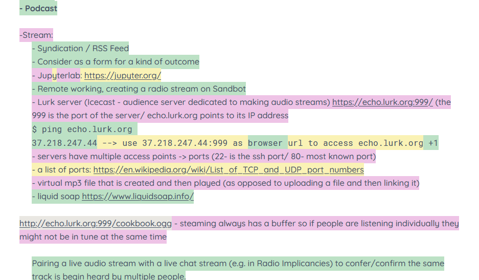

# EtherPatches

This program converts [Etherpad](https://etherpad.org/) screenshots into patched version by removing the text. A step-by-step explanation to create your own EtherPatches can be found on the [PZI Wiki](https://pzwiki.wdka.nl/mediadesign/EtherPatches).

 
